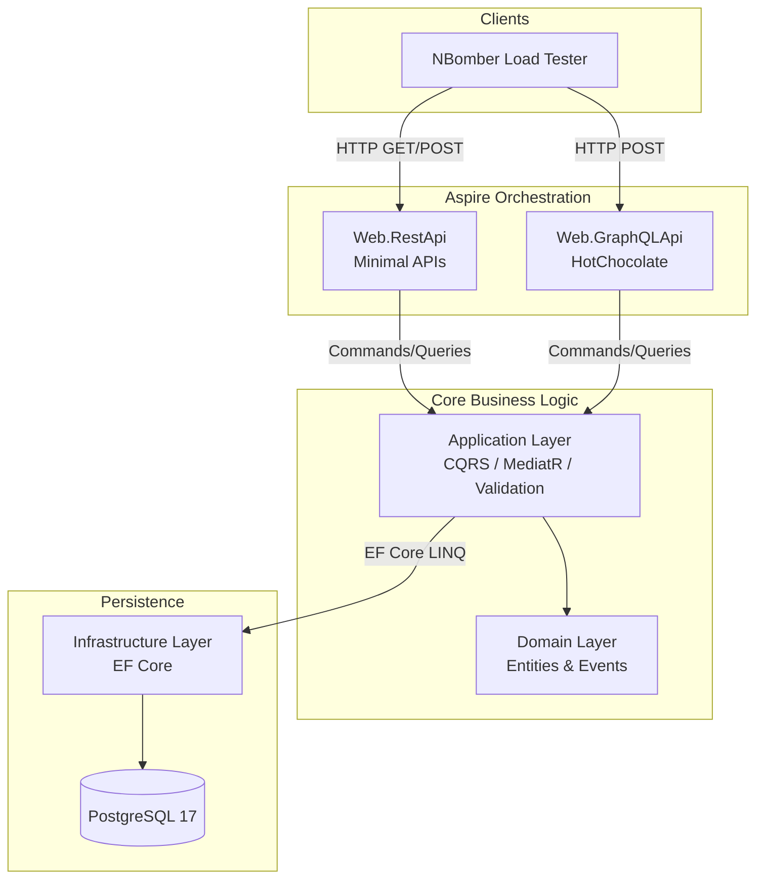
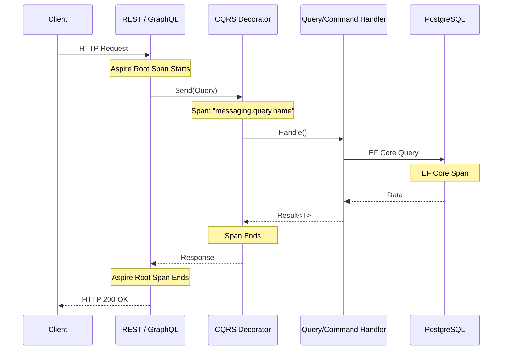

# CommerceHub - .NET 10 REST vs GraphQL Performance Benchmark

CommerceHub is a high-fidelity, modular .NET 10 performance testbed engineered specifically to benchmark and compare **REST** and **GraphQL** architectural styles. 

The core philosophy of this project is **fairness in comparison**: both the REST Minimal APIs and the HotChocolate GraphQL APIs are deployed side-by-side, consuming the exact same Domain, Application (CQRS), and Infrastructure layers. This ensures that any performance variances in latency, throughput, or payload sizes are strictly the result of the API architectures themselves, and not discrepancies in business logic or database access.

---

## 🏛️ Architecture Overview

The solution follows Clean Architecture principles, unified by a CQRS pipeline (`MediatR`) and orchestrated via **.NET Aspire**.



### Key Components

1. **`Domain`**: The heart of the commerce system containing `Catalog`, `Orders`, `Customers`, and `Supplies` aggregates. Uses standard Domain Events and custom error handling (`SharedKernel.Result`).
2. **`Application`**: Implements the CQRS pattern. All API endpoints map 1:1 to a specific Command or Query handler here.
3. **`Infrastructure`**: Houses the EF Core `ApplicationDbContext` and the `SeedDataGenerator`.
4. **`Web.RestApi`**: Exposes the application layer using highly-optimized .NET Minimal APIs.
5. **`Web.GraphQLApi`**: Exposes the application layer using `HotChocolate`, featuring Query/Mutation type extensions mapped directly to the CQRS handlers.
6. **`Benchmarks`**: An independent console application utilizing **NBomber** to blast the APIs with concurrent load.

---

## 🚀 Performance Benchmarking Scenarios

The testbed focuses on specific scenarios designed to highlight the strengths and weaknesses of both REST and GraphQL.

### 1. Basic Fetching & Throughput (S1)
**Goal:** Measure baseline serialization and routing overhead.
- **REST**: `GET /api/products?page=1&pageSize=50`
- **GraphQL**: `query { products(page:1, pageSize: 50) { id name unitPrice stockQuantity ... } }`

### 2. Deep Nesting & Aggregation (S6 - The Dashboard)
**Goal:** Compare the "Over-fetching vs Under-fetching" dilemma and network round-trip costs.
The Dashboard requires data from Orders, Products, and Customers to display top products, low stock alerts, recent orders, and total revenue.
- **REST**: Traditionally requires multiple round-trips to different resources (e.g., `/orders`, `/products`, `/customers`) OR forces the backend to create a highly specific, tightly-coupled `/orders/dashboard` endpoint (which we have implemented here for a fair comparison).
- **GraphQL**: Naturally fetches the exact aggregate tree in a single query by traversing the graph.

---

## 🔍 Observability & Telemetry

Accurate benchmarking requires deep observability. 

We rely on **.NET Aspire's OpenTelemetry integration** combined with custom `System.Diagnostics.Activity` spans injected via a CQRS `LoggingDecorator`. 



By isolating the CQRS layer within its own telemetry span, the Aspire Dashboard allows us to subtract the pure "Business Logic + DB time" from the "Total HTTP Request time". **The delta is the exact overhead introduced by the REST or GraphQL framework.**

---

## 🗄️ Automated Data Seeding

Performance tests are useless on an empty database. 
Upon startup, the EF Core Migration extension invokes the `SeedDataGenerator`, utilizing **Bogus** to synthetically generate:
- `20` Categories
- `50` Suppliers
- `1,000` Products
- `500` Customers
- `2,000` Orders (Randomized with 1-5 line items and dynamic discounts)

---

## 🛠️ How to Run the Benchmarks

### 1. Start the Orchestration
Ensure Docker is running, then boot the Aspire AppHost. This will automatically spin up PostgreSQL, apply EF migrations, seed the database, and host both APIs.

```bash
cd src/Aspire.AppHost
dotnet run
```

### 2. Monitor Telemetry
Open the URL provided by the Aspire console output (usually `http://localhost:18888`) to view the real-time OpenTelemetry dashboard.

### 3. Execute NBomber Load Tests
In a separate terminal, run the standalone NBomber benchmark project.

```bash
cd src/Benchmarks
dotnet run -c Release
```

Once the load simulation concludes, NBomber will generate an extensive HTML report inside the `src/Benchmarks/reports/` directory. Compare the latency (p50, p95, p99), throughput, and data transfer sizes between the REST and GraphQL scenarios.
