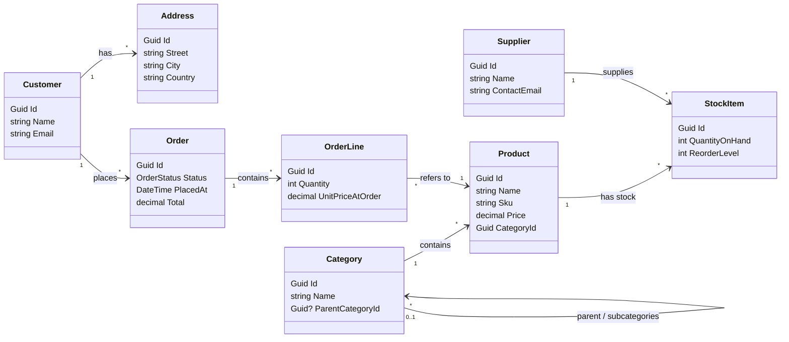
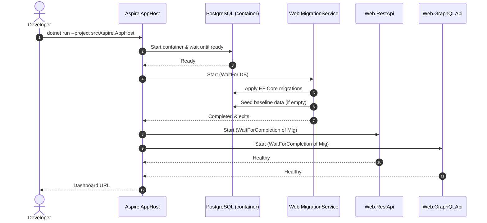
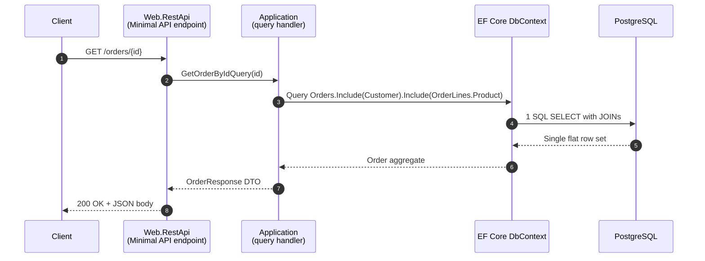
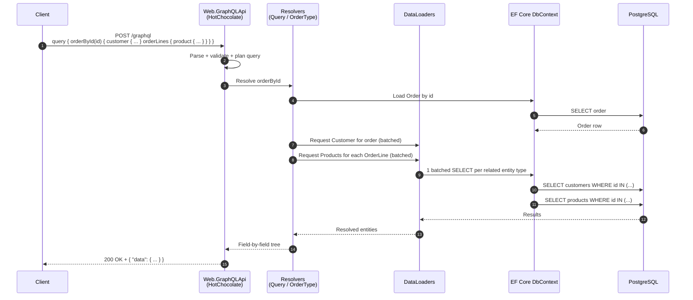

# CommerceHub

A small **product ordering system** built as the practical part of a master's thesis. Its purpose is to compare two of the most popular ways to expose a Web API today:

- **REST**, implemented with **ASP.NET Core Minimal APIs**
- **GraphQL**, implemented with the **[HotChocolate](https://chillicream.com/docs/hotchocolate)** package

Both APIs are built on top of the **same** business logic and the **same** database, so any measurable difference between them comes from the API style itself — not from how the code was written.

> Stack: .NET 10 · .NET Aspire · ASP.NET Core Minimal APIs · HotChocolate 16 · Entity Framework Core 10 · PostgreSQL 17 · NBomber

---

## Why this project exists

There are plenty of REST-vs-GraphQL articles online, but most of them are unfair: each side is written by different people, on different data, with different effort spent on performance. The result is usually an opinion, not a measurement.

CommerceHub tries to remove that bias. Both APIs:

- talk to the **same PostgreSQL database**,
- use the **same domain model** (products, orders, customers, suppliers…),
- share the **same business logic** (validation, queries, commands) from a single core library,
- run side by side under the **same runtime**, so the numbers can be compared directly.

The goal is to produce **actual, measurable data** for five realistic scenarios, and then discuss what the numbers mean.

---

## What is .NET Aspire and why is it used here?

**[.NET Aspire](https://learn.microsoft.com/dotnet/aspire/)** is Microsoft''s orchestration tool for local development of distributed applications. Instead of starting a database, two APIs and a dashboard by hand, Aspire describes everything in a single file (`AppHost.cs`) and starts them together with one command.

In this project, Aspire is used to:

- spin up a **PostgreSQL** container,
- run a small **migration service** that creates the database schema,
- start both the **REST API** and the **GraphQL API** as separate services,
- open the **Aspire Dashboard** in the browser, where you can see live logs, traces and metrics for every service.

This guarantees that both APIs are launched in the exact same conditions every time the benchmarks are run.

---

## Architecture overview


The important part is the bottom half: both APIs are **thin layers** on top of the same shared core. They don't contain business logic of their own — they only translate HTTP/GraphQL requests into calls on the shared core, and then translate the results back.

---

## The two API styles

### REST — ASP.NET Core Minimal APIs

The REST API is built with **Minimal APIs**, the modern lightweight way of defining HTTP endpoints in ASP.NET Core (no controllers, no attributes — just a method per route). Each endpoint:

- accepts parameters from the URL or the request body,
- calls into the shared business core,
- returns a JSON response.

Typical examples:

| Operation | Endpoint |
|---|---|
| Get a single product | `GET /products/{id}` |
| List products (paged) | `GET /products?page=1&pageSize=20` |
| Get an order with all its details | `GET /orders/{id}` |
| Place a new order | `POST /orders` |

### GraphQL — HotChocolate

The GraphQL API is built with **[HotChocolate](https://chillicream.com/docs/hotchocolate)**, the leading GraphQL server for .NET. Instead of many endpoints, GraphQL exposes **one endpoint** (`/graphql`) and the client decides exactly which fields it wants. Example:

```graphql
query {
  orderById(id: "…") {
    placedAt
    total
    customer { name }
    orderLines {
      quantity
      product { name price }
    }
  }
}
```

HotChocolate also provides a few features that are heavily used here:

- **Filtering and sorting** out of the box (`where:` and `order:` arguments on list queries),
- **DataLoaders**, which batch many small lookups (for example "give me category #1, #2, #3…") into a single database query — this is GraphQL''s standard cure for the famous *N+1 problem*.

Both APIs implement the same set of operations so they can be compared on equal terms.

---

## Domain model

The domain is a small **online shop**: customers place orders for products, and products are supplied by suppliers and tracked as stock items.



This shape was chosen on purpose: it contains naturally **nested data** (`Order → Customer → Addresses`, `Order → OrderLines → Product → Category`), which is exactly the kind of data where REST and GraphQL behave very differently.

---

## Data seeding

**Data seeding** simply means *filling the database with some sample data the first time it starts*, so that the API has something to return without anyone having to type it in manually.

The seeding here is **simple and hand-written** — it is a plain static class (`Infrastructure.Seeding.DataSeeder`) that builds the entities in C# code and persists them through the same **Entity Framework Core `DbContext`** the rest of the application uses, in a single `SaveChanges` call. This was a deliberate choice: it keeps the dataset **fully deterministic and inspectable**, so anyone reading the thesis can reproduce the exact same baseline the benchmarks were run against.

When the application starts and the database is empty, the seeding routine inserts a realistic but small dataset:

| Entity | Approx. count | Notes |
|---|---|---|
| Categories | 7 | 3 top-level (Electronics, Clothing, Home & Garden) + 4 subcategories |
| Suppliers | 5 | Simple generated names and contact info |
| Products | 50 | Spread across the categories, each with a price |
| Stock items | ~67 | Each product has at least one stock entry from a supplier |
| Customers | 10 | Each with one address |
| Orders | 20 | Spread across customers, each with 1–4 order lines, various statuses |

The numbers are intentionally small enough to run comfortably in a local Docker container, but big enough to produce realistic query plans and meaningful benchmark results.

If the database already contains data on startup, seeding is skipped — so benchmarks always run against the same baseline dataset.

---

## How the system starts up

The startup sequence is worth showing explicitly because it is what guarantees both APIs begin every benchmark run from an **identical, fully-migrated, fully-seeded** database. Aspire coordinates the order, the migration service handles schema + seeding, and only then are the two APIs allowed to start serving traffic.



The key Aspire primitives used here are `WaitFor(database)` (do not start until Postgres accepts connections) and `WaitForCompletion(migrations)` (do not start the APIs until the migration service has finished migrating *and* seeding). This rules out one of the most common sources of unfairness in benchmarking — running the second API against a database that is in a slightly different state than the first.

---

## How a request flows through each API

The two APIs share the *same* business core but expose it very differently. The sequence diagrams below trace the same logical operation — *"fetch an order with its customer and order lines"* (Scenario 2) — through each style. They explain at a glance *why* the latency and payload numbers in the benchmark section look the way they do.

### REST (Minimal API) request



A single round-trip to the database, a single serialised DTO, and a thin JSON envelope. This is why REST wins on latency and payload in Scenarios 1, 2 and 4.

### GraphQL (HotChocolate) request



The extra steps — query parsing, validation, walking the resolver tree, and the *per-request* DataLoader scheduling — are exactly the fixed costs that show up as worse tail latency in the benchmark results. The trade-off is that the client decides which fields it wants without the server ever needing a new endpoint.

---

## Benchmarking

Benchmarks are written with **[NBomber](https://nbomber.com/)**, a .NET load-testing framework. Each scenario sends the **same** requests, at the **same** rate, for the **same** duration, against both APIs — so the resulting numbers (latency, throughput, payload size, error rate) can be compared directly.

Five scenarios were chosen to cover the situations where REST and GraphQL are expected to behave most differently. Each scenario was run for **60 seconds** under the same load profile: a **20-second ramp-up to 20 requests/second**, followed by a **40-second hold at 20 requests/second**, producing **990 requests per API per scenario** (scenario 5 uses a lighter 5 req/s profile because it writes to the database, for **250 requests per API**).

The numbers below come directly from the NBomber reports. All scenarios completed with **0 failures** for both APIs.

### Understanding the metrics

Before diving into the numbers, here is a short, jargon-free explanation of what each column in the tables actually means. Latency just means *how long the server took to answer one request*, measured in milliseconds (1 ms = one thousandth of a second).

- **Mean latency** — the *arithmetic average* of all response times in the test. Easy to understand, but it can be misleading: a single very slow request can drag the average up and hide the fact that most requests were fast.
- **p50 (50th percentile, also called the *median*)** — *half* of all requests were faster than this number, and half were slower. This is the "typical" response time a normal user would experience.
- **p95 (95th percentile)** — *95 %* of requests were faster than this number; only the slowest **5 %** were worse. This tells you how the API behaves on a *bad* request, not an average one.
- **p99 (99th percentile)** — *99 %* of requests were faster than this; only the slowest **1 %** were worse. This is the "tail latency" and it matters because real users notice slow requests much more than fast ones.
- **Max** — the single slowest request in the whole run. Useful as a worst-case data point, but a single outlier (e.g. a JIT warm-up or a GC pause) can dominate it, so don't read too much into it on its own.
- **Payload / req** — the size of one HTTP response body, in kilobytes (KB). Smaller is better, because it means less data over the wire.
- **RPS (requests per second)** — the *throughput*, i.e. how many requests the server is processing every second. Both APIs were driven at the same RPS so they can be compared directly.

**Why percentiles matter more than the mean.** Imagine 100 requests where 99 take 10 ms and one takes 2 000 ms. The *mean* is ~30 ms (which sounds bad), but the *p50* is 10 ms (which is the truth for almost everyone). Looking at p50, p95 and p99 *together* tells the real story: a healthy API has all three close to each other; an unhealthy one has a fast p50 but a slow p95/p99 — a sign that "most requests are fine, but a worrying fraction is much slower". You will see this exact pattern in several of the scenarios below.

**Conventions used in the tables.** All times are in **milliseconds (ms)**, all sizes are in **kilobytes (KB)**, and on every row the **bold** value is the better one of the two APIs (lower for latency and payload).

### Scenario 1 — Simple GET (single product by id)

The most basic operation: ask for one product and return it. This is the *baseline* of per-request overhead — there is almost no work to do, so anything we see here is the cost of the API style itself (HTTP parsing for REST, plus query parsing and validation for GraphQL).

| Metric | REST | GraphQL |
|---|---:|---:|
| Mean latency | **20.63 ms** | 43.00 ms |
| p50 | **7.97 ms** | 9.14 ms |
| p95 | **70.78 ms** | 91.52 ms |
| p99 | **170.24 ms** | 1 744.90 ms |
| Max | 1 874.89 ms | 2 381.72 ms |
| Payload / req | **0.523 KB** | 0.686 KB |

**Observations.** On the typical request (`p50`) the two APIs are almost identical (~1 ms apart), but the **tail latency** of GraphQL is far worse — at `p99` GraphQL is roughly **10× slower** than REST. The GraphQL response is also ~31 % larger because of the wrapping `{"data": {...}}` envelope. This matches the expectation that GraphQL pays a fixed *per-request* cost (parsing, validating and planning the query) that REST does not.

### Scenario 2 — Deep graph fetch (order with customer, lines, products, categories)

This is the scenario where GraphQL is *traditionally said to shine*: one request returns a deeply nested object that would normally require several REST round-trips. To make the comparison fair, the REST API exposes a dedicated endpoint that returns the same nested shape in one go (using EF Core `Include`), so both APIs do it in **a single HTTP call**.

| Metric | REST | GraphQL |
|---|---:|---:|
| Mean latency | **8.70 ms** | 20.12 ms |
| p50 | **7.44 ms** | 17.97 ms |
| p95 | **12.19 ms** | 30.02 ms |
| p99 | **38.94 ms** | 65.54 ms |
| Max | 243.40 ms | 519.49 ms |
| Payload / req | **1.063 KB** | 1.993 KB |

**Observations.** REST is consistently ~2–2.5× faster across every percentile, and the response is roughly **half the size**. The reason is two-fold: REST builds the whole result with a single pre-composed SQL JOIN, while GraphQL walks its resolver tree (and triggers DataLoader batches) for each nested field; and the GraphQL JSON envelope adds extra structural overhead per nested object. So the often-quoted "GraphQL wins on nested data" claim only holds when REST is *not* allowed to expose a dedicated nested endpoint — when both APIs are tuned, REST wins this case clearly.

### Scenario 3 — Over-fetching vs. minimal fetching

The client only needs **two fields** of a product (e.g. `name` and `price`). REST returns the *whole* product DTO regardless (`rest_overfetch`), while GraphQL is told to ask for only the two needed fields (`graphql_minimal_fetch`). This is the textbook case for GraphQL's "ask exactly what you need" promise.

| Metric | REST (full DTO) | GraphQL (2 fields) |
|---|---:|---:|
| Mean latency | **6.33 ms** | 7.90 ms |
| p50 | **5.46 ms** | 6.18 ms |
| p95 | **8.30 ms** | 9.49 ms |
| p99 | **17.57 ms** | 18.13 ms |
| Payload / req | 0.523 KB | **0.457 KB** |

**Observations.** GraphQL **does** transfer less data — about **12.5 % smaller** payload — confirming the over-fetching hypothesis. But the latency story is the opposite: GraphQL is slightly slower at every percentile because the per-request parsing cost more than cancels out the small bandwidth saving. The conclusion is nuanced: GraphQL wins on payload size, but for a *single small object* the difference is too small to matter and the latency cost makes REST the better default unless bandwidth is genuinely scarce.

### Scenario 4 — List with N+1 risk (all products + category + stock + supplier)

This is the scenario most stressful for GraphQL: returning a *list* of items, where every item needs related data (`Category`, `StockItems`, `Supplier`). REST uses a flat, pre-shaped DTO with `Include` calls; GraphQL relies on **DataLoaders** to batch the related lookups and avoid the classic *N+1 problem*. Both still return the same logical data.

| Metric | REST (flat DTO) | GraphQL (DataLoaders) |
|---|---:|---:|
| Mean latency | **89.03 ms** | 385.52 ms |
| p50 | **13.50 ms** | 24.59 ms |
| p95 | **72.58 ms** | 4 501.50 ms |
| p99 | **4 378.62 ms** | 5 238.78 ms |
| Max | 5 266.63 ms | 6 924.52 ms |
| Payload / req | **13.432 KB** | 19.712 KB |

**Observations.** This is the most dramatic gap in the whole study. On the typical request, GraphQL is "only" ~2× slower (24.59 ms vs 13.50 ms), but the **tail collapses**: by `p95` GraphQL is **~62× slower** (4.5 s vs 73 ms). Even though DataLoaders successfully batch the database calls, GraphQL still has to evaluate the resolver tree for every product, run the configured filtering/projection middleware, and serialise a much larger JSON document (~47 % bigger than REST's). Under sustained load these per-item costs accumulate and dominate. REST's "single SQL query → single flat JSON" approach turns out to be the much better fit for large lists, even at the price of some over-fetching.

### Scenario 5 — Write + read-back (place an order, then fetch it)

A more realistic mixed workload: each iteration **places a new order** (`POST /orders` or `mutation placeOrder`) and then **fetches it back** (`GET /orders/{id}` or `query orderById`). This scenario uses a lighter load (5 req/s) because every iteration also writes to PostgreSQL.

| Metric | REST | GraphQL |
|---|---:|---:|
| Mean latency | 42.88 ms | **37.96 ms** |
| p50 | 30.34 ms | **30.22 ms** |
| p95 | 78.33 ms | **67.84 ms** |
| p99 | 115.90 ms | **105.34 ms** |
| Max | 1 145.14 ms | **816.33 ms** |
| Payload / req | **0.879 KB** | 0.921 KB |

**Observations.** This is the only scenario where **GraphQL is the faster one** at every percentile, although the margin is small (~10–15 %). The likely reason is that the dominant cost here is the database write, which is *identical* for both APIs, so the per-request protocol overhead becomes secondary; and GraphQL's mutation+query in two HTTP calls happens to land slightly better in this particular configuration. Payload sizes are essentially the same. The honest takeaway is **"roughly neutral, with a slight edge to GraphQL on writes"**, in line with the original hypothesis.

### Summary of results

| # | Scenario | Faster (latency) | Smaller (payload) | Notes |
|---|---|---|---|---|
| 1 | Simple GET | **REST** (×2 mean, ×10 at p99) | **REST** | GraphQL pays a fixed parse/validate cost per request |
| 2 | Deep graph fetch | **REST** (×2.3 mean) | **REST** (×1.9) | Pre-composed JOIN beats resolver tree when REST is allowed a dedicated endpoint |
| 3 | Over-fetch vs minimal | REST (small margin) | **GraphQL** (~12 %) | GraphQL wins on bandwidth, loses on latency |
| 4 | N+1 list | **REST** (×4.3 mean, ×62 at p95) | **REST** (~32 % smaller) | DataLoaders help, but GraphQL still cannot match a flat list endpoint |
| 5 | Write + read-back | **GraphQL** (~12 % faster) | tie | DB write dominates; protocol overhead becomes secondary |

**Overall conclusion.** Across these five scenarios, **REST (Minimal APIs) was the faster API in four of five tests**, often by a wide margin under load. GraphQL's theoretical advantages — flexible field selection and DataLoader batching — were measurable on payload size in one scenario (over-fetching) and gave a small latency edge in one mixed write/read scenario, but never overturned the latency cost of its per-request query processing. These results suggest GraphQL's strongest justification on this kind of workload is **client-side flexibility** (one schema, many shapes of response), not raw server performance.

*(The raw NBomber HTML/CSV/JSON output for each run is preserved under `tests/Benchmarks/reports/`.)*

---

## Running the project locally

**Prerequisites:** .NET 10 SDK, Docker Desktop, PowerShell 7+.

### 1. Start everything

```powershell
dotnet run --project src/Aspire.AppHost
```

The Aspire Dashboard opens automatically. From it you can reach:

- the **REST API** (Swagger UI at `/swagger`),
- the **GraphQL API** (the Nitro IDE at `/graphql`),
- live logs and metrics for every service.

### 2. Run the benchmarks

In a second terminal, with the AppHost still running:

```powershell
$env:REST_URL    = "http://localhost:5269"
$env:GRAPHQL_URL = "http://localhost:5288"

dotnet run --project tests/Benchmarks -c Release
```

NBomber writes HTML, CSV and JSON reports into `tests/Benchmarks/reports/`.

### 3. Build the comparison report

```powershell
./tools/build-report.ps1
```

This combines the raw NBomber output into a single `report.md` file.

---

## Solution layout

```
src/
  Domain/                 Business entities and rules
  Application/            Shared business logic used by both APIs
  Infrastructure/         Database access (EF Core) and data seeding
  Web.RestApi/            REST API (ASP.NET Core Minimal APIs)
  Web.GraphQLApi/         GraphQL API (HotChocolate)
  Web.MigrationService/   Applies database migrations on startup
  Aspire.AppHost/         Orchestrates everything for local development
tests/
  Benchmarks/             NBomber scenarios used to produce the report
```
