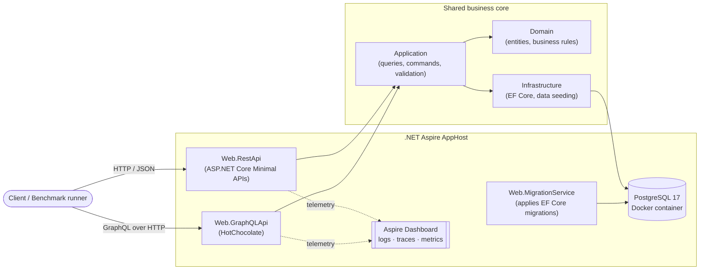
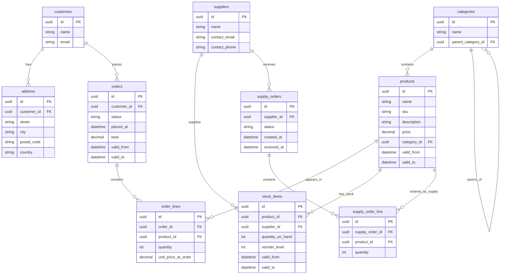
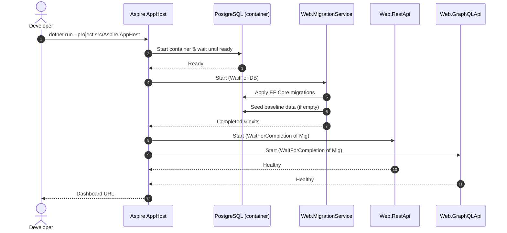
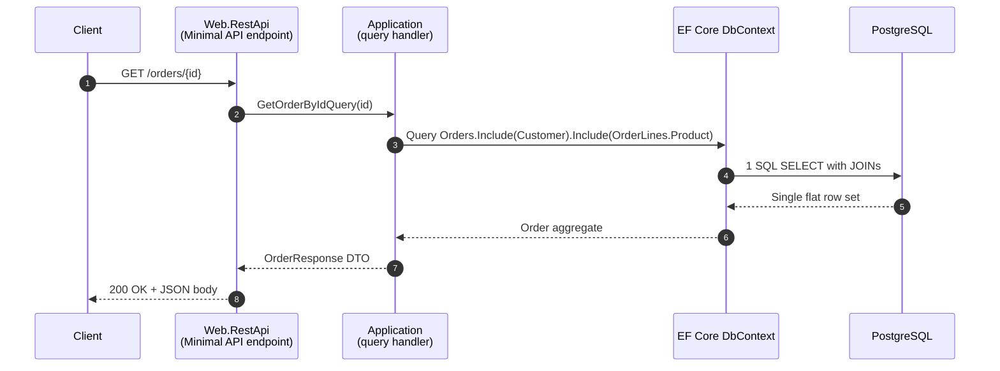
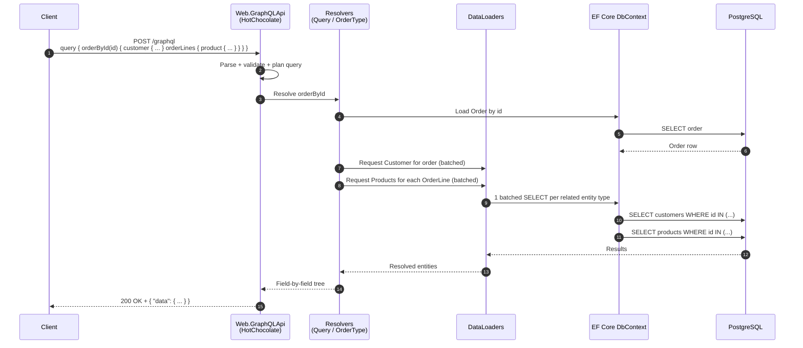

# CommerceHub

A small **product ordering system** built as the practical part of a master's thesis. Its purpose is to compare two of the most popular ways to expose a Web API today:

- **REST**, implemented with **ASP.NET Core Minimal APIs**
- **GraphQL**, implemented with the **[HotChocolate](https://chillicream.com/docs/hotchocolate)** package

Both APIs are built on top of the **same** business logic and the **same** database, so any measurable difference between them comes from the API style itself — not from how the code was written.

> Stack: .NET 10 · .NET Aspire · ASP.NET Core Minimal APIs · HotChocolate 16 · Entity Framework Core 10 · PostgreSQL 17 · NBomber

---

## Why this project exists

There are plenty of REST-vs-GraphQL articles online, but most of them are unfair: each side is written by different people, on different data, with different effort spent on performance. The result is usually an opinion, not a measurement.

CommerceHub tries to remove that bias. Both APIs:

- talk to the **same PostgreSQL database**,
- use the **same domain model** (products, orders, customers, suppliers…),
- share the **same business logic** (validation, queries, commands) from a single core library,
- run side by side under the **same runtime**, so the numbers can be compared directly.

The goal is to produce **actual, measurable data** for five realistic scenarios, and then discuss what the numbers mean.

---

## What is .NET Aspire and why is it used here?

**[.NET Aspire](https://learn.microsoft.com/dotnet/aspire/)** is Microsoft's orchestration tool for local development of distributed applications. Instead of starting a database, two APIs and a dashboard by hand, Aspire describes everything in a single file (`AppHost.cs`) and starts them together with one command.

In this project, Aspire is used to:

- spin up a **PostgreSQL** container,
- run a small **migration service** that creates the database schema,
- start both the **REST API** and the **GraphQL API** as separate services,
- open the **Aspire Dashboard** in the browser, where you can see live logs, traces and metrics for every service.

This guarantees that both APIs are launched in the exact same conditions every time the benchmarks are run.

---

## Architecture overview



The important part is the bottom half: both APIs are **thin layers** on top of the same shared core. They don't contain business logic of their own — they only translate HTTP/GraphQL requests into calls on the shared core, and then translate the results back.

---

## The two API styles

### REST — ASP.NET Core Minimal APIs

The REST API is built with **Minimal APIs**, the modern lightweight way of defining HTTP endpoints in ASP.NET Core (no controllers, no attributes — just a method per route). Each endpoint:

- accepts parameters from the URL or the request body,
- calls into the shared business core,
- returns a JSON response.

Typical examples:

| Operation | Endpoint |
|---|---|
| Get a single product | `GET /products/{id}` |
| List products (paged) | `GET /products?page=1&pageSize=20` |
| Get an order with all its details | `GET /orders/{id}` |
| Place a new order | `POST /orders` |

### GraphQL — HotChocolate

The GraphQL API is built with **[HotChocolate](https://chillicream.com/docs/hotchocolate)**, the leading GraphQL server for .NET. Instead of many endpoints, GraphQL exposes **one endpoint** (`/graphql`) and the client decides exactly which fields it wants. Example:

```graphql
query {
  orderById(id: "…") {
    placedAt
    total
    customer { name }
    orderLines {
      quantity
      product { name price }
    }
  }
}
```

HotChocolate also provides a few features that are heavily used here:

- **Filtering and sorting** out of the box (`where:` and `order:` arguments on list queries),
- **DataLoaders**, which batch many small lookups (for example "give me category #1, #2, #3…") into a single database query — this is GraphQL''s standard cure for the famous *N+1 problem*.

Both APIs implement the same set of operations so they can be compared on equal terms.

---

## Domain model

The domain is a small **online shop**: customers place orders for products, and products are supplied by suppliers and tracked as stock items.



This shape was chosen on purpose: it contains naturally **nested data** (`Order → Customer → Addresses`, `Order → OrderLines → Product → Category`), which is exactly the kind of data where REST and GraphQL behave very differently.

---

## Data seeding

**Data seeding** simply means *filling the database with some sample data the first time it starts*, so that the API has something to return without anyone having to type it in manually.

The seeding here is plain and hand-written — a small static class (`Infrastructure.Seeding.DataSeeder`) builds the entities in C# code and persists them through the same **Entity Framework Core `DbContext`** the rest of the application uses, in a single `SaveChanges` call. No data-generation library is involved, so the resulting dataset is fully deterministic.

When the application starts and the database is empty, the seeder inserts a small but realistic dataset:

| Entity | Approx. count | Notes |
|---|---|---|
| Categories | 7 | 3 top-level (Electronics, Clothing, Home & Garden) + 4 subcategories |
| Suppliers | 5 | Simple generated names and contact info |
| Products | 50 | Spread across the categories, each with a price |
| Stock items | ~67 | Each product has at least one stock entry from a supplier |
| Customers | 10 | Each with one address |
| Orders | 20 | Spread across customers, each with 1–4 order lines, various statuses |

The numbers are intentionally small enough to run comfortably in a local Docker container, but big enough to produce realistic query plans and meaningful benchmark results.

If the database already contains data on startup, seeding is skipped — so benchmarks always run against the same baseline dataset.

---

## How the system starts up

The startup sequence is worth showing explicitly because it is what guarantees both APIs begin every benchmark run from an **identical, fully-migrated, fully-seeded** database. Aspire coordinates the order, the migration service handles schema + seeding, and only then are the two APIs allowed to start serving traffic.



The key Aspire primitives used here are `WaitFor(database)` (do not start until Postgres accepts connections) and `WaitForCompletion(migrations)` (do not start the APIs until the migration service has finished migrating *and* seeding). This rules out one of the most common sources of unfairness in benchmarking — running the second API against a database that is in a slightly different state than the first.

---

## How a request flows through each API

The two APIs share the *same* business core but expose it very differently. The sequence diagrams below trace the same logical operation — *"fetch an order with its customer and order lines"* (Scenario 2) — through each style. They explain at a glance *why* the latency and payload numbers in the benchmark section look the way they do.

### REST (Minimal API) request



A single round-trip to the database, a single serialised DTO, and a thin JSON envelope. This is why REST wins on latency and payload in Scenarios 1, 2 and 4.

### GraphQL (HotChocolate) request



The extra steps — query parsing, validation, walking the resolver tree, and the *per-request* DataLoader scheduling — are exactly the fixed costs that show up as worse tail latency in the benchmark results. The trade-off is that the client decides which fields it wants without the server ever needing a new endpoint.

---

## Benchmarking

Benchmarks are written with **[NBomber](https://nbomber.com/)**, a .NET load-testing framework. Each scenario sends the **same** requests, at the **same** rate, for the **same** duration, against both APIs — so the resulting numbers (latency, throughput, payload size, error rate) can be compared directly.

Five scenarios were chosen to cover the situations where REST and GraphQL are expected to behave most differently. Each scenario was run for **60 seconds** under the same load profile: a **20-second ramp-up to 20 requests/second**, followed by a **40-second hold at 20 requests/second**, producing **990 requests per API per scenario** (scenario 5 uses a lighter 5 req/s profile because it writes to the database, for **250 requests per API**).

To keep the comparison clean, REST and GraphQL are run in **separate, isolated passes** (one after the other, each with its own connection pool) rather than concurrently, so the two APIs never contend for the database or the load generator at the same time. A short **discarded warm-up run** precedes the measured scenarios to absorb JIT and EF Core query-plan compilation, so the numbers below reflect steady-state behaviour rather than cold start.

The numbers below come directly from the NBomber reports. All scenarios completed with **0 failures** for both APIs.

### Understanding the metrics

Before diving into the numbers, here is a short, jargon-free explanation of what each column in the tables actually means. Latency just means *how long the server took to answer one request*, measured in milliseconds (1 ms = one thousandth of a second).

- **Mean latency** — the *arithmetic average* of all response times in the test. Easy to understand, but it can be misleading: a single very slow request can drag the average up and hide the fact that most requests were fast.
- **p50 (50th percentile, also called the *median*)** — *half* of all requests were faster than this number, and half were slower. This is the "typical" response time a normal user would experience.
- **p95 (95th percentile)** — *95 %* of requests were faster than this number; only the slowest **5 %** were worse. This tells you how the API behaves on a *bad* request, not an average one.
- **p99 (99th percentile)** — *99 %* of requests were faster than this; only the slowest **1 %** were worse. This is the "tail latency" and it matters because real users notice slow requests much more than fast ones.
- **Max** — the single slowest request in the whole run. Useful as a worst-case data point, but a single outlier (e.g. a JIT warm-up or a GC pause) can dominate it, so don't read too much into it on its own.
- **Payload / req** — the size of one HTTP response body, in kilobytes (KB). Smaller is better, because it means less data over the wire.
- **RPS (requests per second)** — the *throughput*, i.e. how many requests the server is processing every second. Both APIs were driven at the same RPS so they can be compared directly.

**Why percentiles matter more than the mean.** Imagine 100 requests where 99 take 10 ms and one takes 2 000 ms. The *mean* is ~30 ms (which sounds bad), but the *p50* is 10 ms (which is the truth for almost everyone). Looking at p50, p95 and p99 *together* tells the real story: a healthy API has all three close to each other; an unhealthy one has a fast p50 but a slow p95/p99 — a sign that "most requests are fine, but a worrying fraction is much slower". You will see this exact pattern in several of the scenarios below.

**Conventions used in the tables.** All times are in **milliseconds (ms)**, all sizes are in **kilobytes (KB)**, and on every row the **bold** value is the better one of the two APIs (lower for latency and payload).

### Scenario 1 — Simple GET (single product by id)

The most basic operation: ask for one product and return it. This is the *baseline* of per-request overhead — there is almost no work to do, so anything we see here is the cost of the API style itself (HTTP parsing for REST, plus query parsing and validation for GraphQL). Both APIs return the **same fields** (id, name, SKU, description, price, category id and category name), so the payloads differ only by the GraphQL envelope.

| Metric | REST | GraphQL |
|---|---:|---:|
| Mean latency | **4.70 ms** | 7.28 ms |
| p50 | **4.37 ms** | 7.02 ms |
| p95 | **6.69 ms** | 9.66 ms |
| p99 | **10.83 ms** | 14.18 ms |
| Max | **40.60 ms** | 47.10 ms |
| Payload / req | **0.528 KB** | 0.739 KB |

**Observations.** REST is faster at every percentile by a consistent ~2–3 ms, and the gap between p50 and p99 is small for *both* APIs (no tail collapse). This is the clean per-request cost of GraphQL — parsing, validating and planning the query — paid on every call. The GraphQL response is also ~40 % larger, almost entirely due to the wrapping `{"data": {...}}` envelope on a tiny body.

### Scenario 2 — Deep graph fetch (order with customer, lines, products, categories)

This is the scenario where GraphQL is *traditionally said to shine*: one request returns a deeply nested object that would normally require several REST round-trips. To make the comparison fair, the REST API exposes a dedicated endpoint that returns the same nested shape in one go (using EF Core `Include`), and the GraphQL query selects the **exact same fields** as the REST DTO (order header, customer name/email, and order lines with product name/SKU) - so both APIs return identical data in **a single HTTP call**.

| Metric | REST | GraphQL |
|---|---:|---:|
| Mean latency | **4.98 ms** | 8.07 ms |
| p50 | **4.68 ms** | 6.98 ms |
| p95 | **6.66 ms** | 10.74 ms |
| p99 | **10.74 ms** | 30.45 ms |
| Max | **102.58 ms** | 120.58 ms |
| Payload / req | **1.078 KB** | 1.348 KB |

**Observations.** REST is ~1.6× faster on the typical request and the payload is ~25 % smaller. The difference is two-fold - REST builds the result with a single pre-composed SQL JOIN, while GraphQL walks its resolver tree (and triggers DataLoader batches) for each nested field; and the GraphQL envelope adds structural overhead per nested object. GraphQL's tail (p99) is still ~3× REST's, the cost of per-request planning plus per-field resolution. The often-quoted "GraphQL wins on nested data" claim only holds when REST is *not* allowed a dedicated nested endpoint — when both are tuned and asked for the same data, REST wins this case.

### Scenario 3 — Over-fetching vs. minimal fetching

The client only needs **two fields** of a product (e.g. `name` and `price`). REST returns the *whole* product DTO regardless (`rest_overfetch`), while GraphQL is told to ask for only the two needed fields (`graphql_minimal_fetch`).

| Metric | REST (full DTO) | GraphQL (2 fields) |
|---|---:|---:|
| Mean latency | 4.53 ms | **4.09 ms** |
| p50 | 4.02 ms | **3.94 ms** |
| p95 | 6.28 ms | **5.57 ms** |
| p99 | 14.20 ms | **7.34 ms** |
| Payload / req | 0.528 KB | **0.460 KB** |

**Observations.** This is the textbook case for GraphQL's "ask exactly what you need" promise, and it delivers on both axes: GraphQL transfers ~13 % less data **and** is faster at every percentile, with a notably tighter tail (p99 7.34 ms vs 14.20 ms). The reason GraphQL now also wins on latency is that the selective query genuinely fetches and materialises less - REST still projects and serialises the full DTO every time. When the client truly needs only a subset of fields, GraphQL's selectivity is a real, measurable advantage.

### Scenario 4 — Paged product list

This scenario represents a common product listing screen. Both APIs return the first page of products using the same pagination parameters (`page = 1`, `pageSize = 50`) and the same logical response shape: product id, name, SKU, description, price and category name. The GraphQL query uses **server-side projection** (`[UseProjection]`), so HotChocolate emits a column-projected SQL query that mirrors the REST DTO projection instead of materialising full entities, with the category name resolved through a batched DataLoader.

| Metric | REST | GraphQL |
|---|---:|---:|
| Mean latency | **5.42 ms** | 9.70 ms |
| p50 | **5.27 ms** | 8.02 ms |
| p95 | **7.52 ms** | 12.23 ms |
| p99 | **8.86 ms** | 67.58 ms |
| Max | **14.42 ms** | 111.20 ms |
| Payload / req | **13.553 KB** | 14.016 KB |

**Observations.** Once both sides project the same columns and run in isolation, REST is faster across every percentile - modestly on the typical request (~2.7 ms at p50) but markedly in the tail (p99 8.86 ms vs 67.58 ms). For a 50-item list GraphQL still pays per-item resolver evaluation plus a second batched query for categories, and that overhead shows up as a heavier, more variable tail under sustained load. Payloads are nearly identical (~3 % apart).

### Scenario 5 — Write + read-back (place an order, then fetch it)

A more realistic mixed workload: each iteration **places a new order** and then **fetches it back**. Both APIs now do **two round trips** - REST as `POST /orders` then `GET /orders/{id}`, and GraphQL as a `placeOrder` mutation (returning only the id, like REST's POST) followed by a separate `orderById` query whose selection set matches REST's read-back. This scenario uses a lighter load (5 req/s) because every iteration also writes to PostgreSQL.

| Metric | REST | GraphQL |
|---|---:|---:|
| Mean latency | **24.14 ms** | 28.55 ms |
| p50 | **15.82 ms** | 24.05 ms |
| p95 | **45.57 ms** | 49.41 ms |
| p99 | 166.27 ms | **137.22 ms** |
| Max | 870.01 ms | **386.84 ms** |
| Payload / req | **0.889 KB** | 1.160 KB |

**Observations.** With both sides writing *and* reading back, REST is faster on the typical request - p50 15.82 ms vs 24.05 ms - and on p95. GraphQL only pulls ahead in the extreme tail (p99 and max), where its more uniform execution avoids REST's occasional large spikes. The dominant cost in this scenario is the database write, which is identical for both APIs, so the protocol overhead is secondary. The honest takeaway is **"roughly comparable on writes, REST slightly ahead on the typical request, GraphQL steadier in the tail"**.

### Summary of results

| # | Scenario | Faster (latency) | Smaller (payload) | Notes |
|---|---|---|---|---|
| 1 | Simple GET | **REST** (~1.6× mean) | **REST** | Matched fields; GraphQL pays a steady parse/validate cost per request |
| 2 | Deep graph fetch | **REST** (~1.6× p50) | **REST** (~25 %) | Identical selection set; pre-composed JOIN beats the resolver tree |
| 3 | Over-fetch vs minimal | **GraphQL** (all percentiles) | **GraphQL** (~13 %) | Selective query does less work once wasteful includes are removed |
| 4 | Paged list (50 items) | **REST** (~2.7 ms p50, heavier GQL tail) | **REST** (~3 %) | Matched projections; REST's single projected query wins, gap modest |
| 5 | Write + read-back | **REST** (p50/p95); GraphQL steadier tail | **REST** | Both do write + read-back; DB write dominates |

**Overall conclusion.** **REST (Minimal APIs) is the faster API in four of the five scenarios**, usually by a modest and consistent margin. GraphQL wins cleanly in the one scenario built for it (over-fetching), where selecting only the needed fields means genuinely less work and less data. The takeaway is that GraphQL's strongest justification on this kind of workload is **client-side flexibility** (one schema, many response shapes) plus a real edge **when clients fetch narrow subsets of large objects**, rather than raw server performance on fixed-shape responses.

*(The raw NBomber CSV/Markdown/TXT output for each run is preserved under `reports/`, split into per-scenario `rest/` and `graphql/` sub-folders.)*

---

## Limitations and honest caveats

No benchmark setup is perfect, and the numbers above describe **this specific configuration** — not REST or GraphQL in the abstract. The most important caveats to keep in mind when interpreting them:

- **Single-machine setup.** Both APIs, PostgreSQL and the load generator all run on the same physical machine over `localhost`. There is no real network in between, so the absolute latencies are best-case numbers. On a real network, the *relative* gap between the two APIs would likely shrink (because network round-trip time becomes the dominant cost), but the ordering of the results would not change.
- **Cold start is excluded by a warm-up.** A discarded warm-up run precedes the measured scenarios, and REST/GraphQL run in separate passes, so JIT, EF Core model warm-up and connection-pool warm-up no longer pollute the first measured requests. Absolute numbers still reflect a freshly started process, just past its warm-up.
- **Small dataset.** The seeded dataset is relatively small (50 products, 20 orders). Effects that only show up on large tables — index-vs-scan trade-offs, large result-set streaming, deep pagination cost — are not exercised here.
- **REST was given a tuned, dedicated nested endpoint.** Scenario 2 deliberately compares *well-designed REST* (a purpose-built endpoint returning the whole nested shape in one query) against GraphQL asked for the same fields. A naive REST API requiring several round-trips would look much worse, and GraphQL's relative advantage would grow.
- **GraphQL was used with HotChocolate's defaults.** DataLoaders, server-side projections and the filtering/sorting middleware are all enabled. They help in some scenarios and add overhead in others; turning any of them off would shift the results.
- **No caching layer is in the picture.** Neither output caching (ASP.NET Core), HTTP caching headers, nor GraphQL *persisted queries* / Automatic Persisted Queries are configured. Persisted queries in particular would meaningfully reduce GraphQL's per-request parse cost — i.e. one of the costs that hurts it most in Scenario 1.
- **No authentication, rate limiting or response compression.** These would add overhead to *both* APIs but are deliberately omitted so the measurement focuses on the API style itself.
- **HTTP/1.1 over plain TCP.** Both APIs are served over HTTP/1.1 without TLS. Using HTTP/2 (multiplexing) or gRPC on the REST side, or HTTP/3 on either side, could shift the results.

In short: the results are valid evidence about *this* implementation and *this* workload. They are a strong indicator of where REST and GraphQL tend to differ, but they are not a universal verdict on either technology.

---

## Running the project locally

**Prerequisites:** .NET 10 SDK, Docker Desktop, PowerShell 7+.

### 1. Start everything

```powershell
dotnet run --project src/Aspire.AppHost
```

The Aspire Dashboard opens automatically. From it you can reach:

- the **REST API** (Swagger UI at `/swagger`),
- the **GraphQL API** (the Nitro IDE at `/graphql`),
- live logs and metrics for every service.

### 2. Run the benchmarks

In a second terminal, with the AppHost still running, point the benchmark at the **actual HTTP endpoints** the APIs were assigned. Aspire allocates these ports dynamically, so copy the current `web-restapi` and `web-graphqlapi` HTTP URLs from the Aspire Dashboard:

```powershell
$env:REST_URL    = "http://localhost:<rest-port>"
$env:GRAPHQL_URL = "http://localhost:<graphql-port>"

dotnet run --project tests/Benchmarks -c Release
```

NBomber runs REST and GraphQL in isolated passes and writes HTML, CSV, Markdown and TXT reports into per-scenario `reports/<n>_<scenario>/{rest,graphql}/` folders.

### 3. Build the comparison report

```powershell
./tools/build-report.ps1
```

This combines the raw NBomber output into a single `report.md` file.

---

## Solution layout

```
src/
  Domain/                 Business entities and rules
  Application/            Shared business logic used by both APIs
  Infrastructure/         Database access (EF Core) and data seeding
  Web.RestApi/            REST API (ASP.NET Core Minimal APIs)
  Web.GraphQLApi/         GraphQL API (HotChocolate)
  Web.MigrationService/   Applies database migrations on startup
  Aspire.AppHost/         Orchestrates everything for local development
tests/
  Benchmarks/             NBomber scenarios used to produce the report
```
